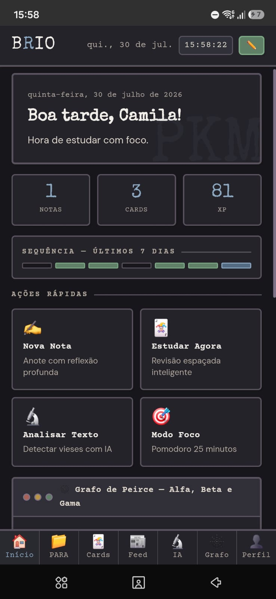
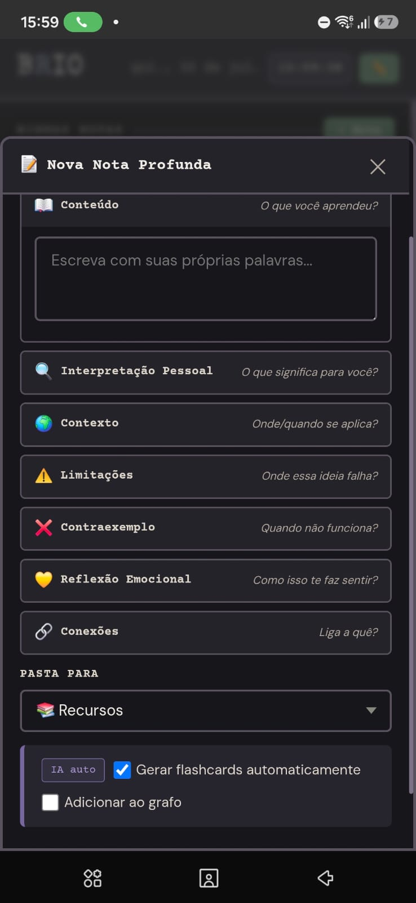
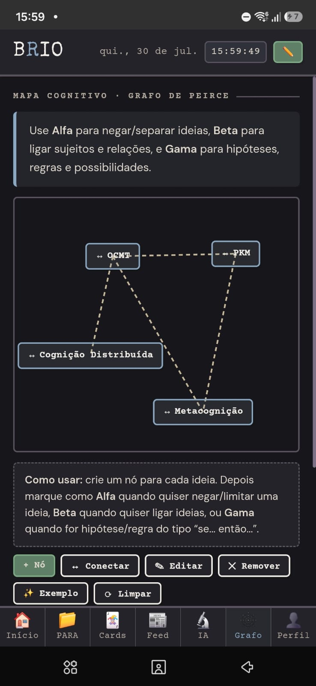
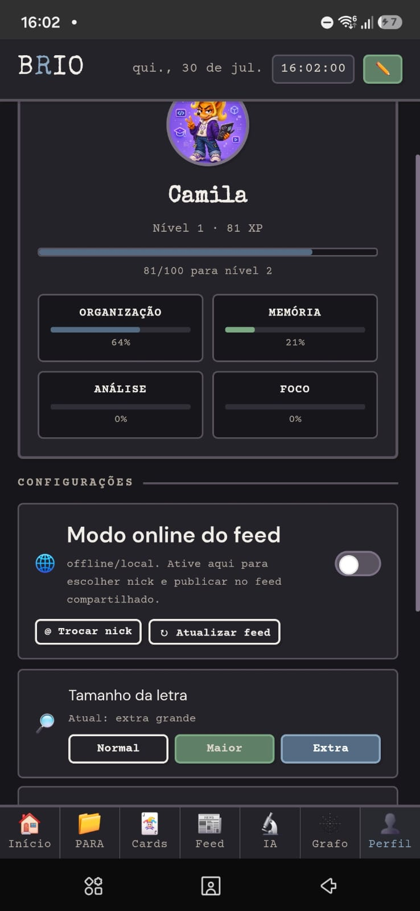

# BRIO — Aplicação Educacional 📚💻

Aplicação EdTech em desenvolvimento para auxiliar professores no planejamento, na organização e no acompanhamento da rotina docente.

## Sobre o projeto

O **BRIO** nasceu como uma proposta de ferramenta digital voltada às necessidades reais de professores.

A aplicação busca reunir, em um mesmo ambiente, recursos para organização de turmas, planejamento de aulas, acompanhamento pedagógico e registro da prática docente.

## Capturas de tela

<p align="center">
  
  
</p>

<p align="center">
  
  
</p>

## Objetivo

Desenvolver uma ferramenta acessível, organizada e intuitiva que ajude professores a administrar informações escolares e refletir sobre sua prática pedagógica.

## Funcionalidades planejadas e em desenvolvimento

- Cadastro de turmas e estudantes
- Planejamento de aulas
- Organização de objetivos pedagógicos
- Registro de presença e avaliações
- Observações individuais dos estudantes
- Diário e reflexão docente
- Organização da rotina
- Temporizador Pomodoro
- Registro do humor do dia
- Recursos de acessibilidade e inclusão
- Apoio à elaboração de atividades
- Integração futura com a BNCC
- Salvamento das informações da aplicação

## Tecnologias utilizadas

### Aplicativo Android

- Kotlin
- Android Studio
- Gradle
- XML ou Jetpack Compose — a confirmar

### Protótipo para navegador

- HTML
- CSS
- JavaScript

## Estrutura planejada

```text
brio-app-educacional/
├── index.html
├── css/
│   └── style.css
├── javascript/
│   └── script.js
├── imagens/
└── README.md

Professores, estudantes de licenciatura e profissionais da educação que procuram uma ferramenta de apoio à organização pedagógica.

🚧 Protótipo em desenvolvimento.

O projeto ainda está sendo construído e poderá receber alterações em sua estrutura, aparência e funcionalidades.

Autora

Desenvolvido por Camila Espíndola, estudante de Licenciatura em Linguagens e desenvolvedora em formação.
